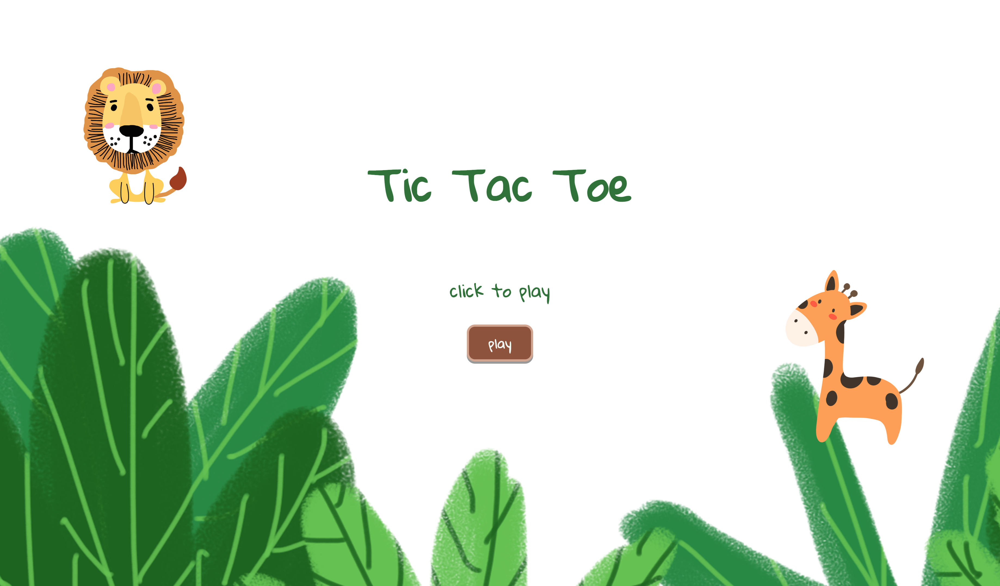
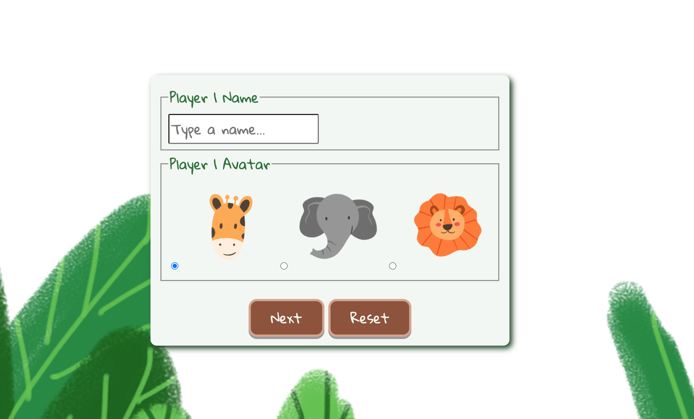
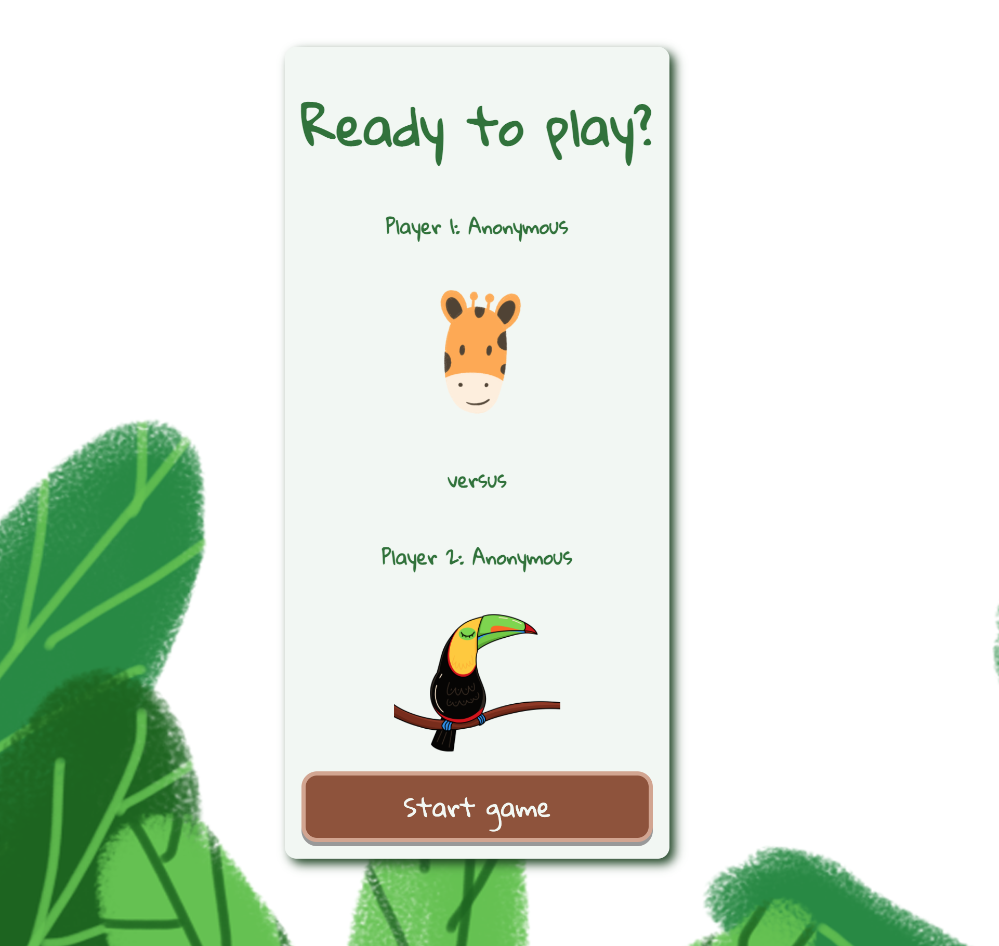
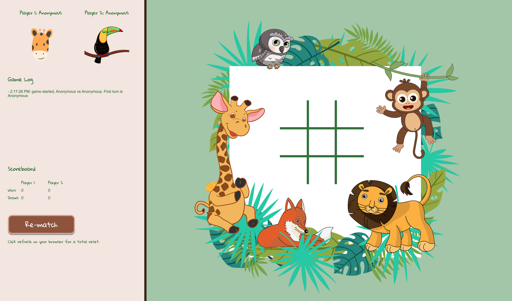

# Tic Tac Toe for kids

## General Assembly Software Engineering Immersive 

  

[Visit website](https://chris-pollard.github.io/tic-tac-toe-for-kids/)

First published 21 May 2021

### Purpose
The purpose of this project is to demonstrate skills learnt in the first three weeks of the Software Engineering Immersive course at General Assembly; namely javaScript (including DOM manipulation), basic HTML and basic CSS.

### Application requirements
The app must:

- Render a game in the browser
- Switch turns between more than one player (2 player playing on a single computer)
- Design logic for winning & visually display which player won
- Design logic for a draw game & visually display when there is a draw
- Include separate HTML / CSS / JavaScript files
- Use Javascript for DOM manipulation
- Deploy the game online
- Use semantic markup for HTML and CSS (adhere to best practices)  

[Link to project requirements document](https://gist.github.com/epoch/70e4ca24dc3b7ca1de8def58bc85d194)